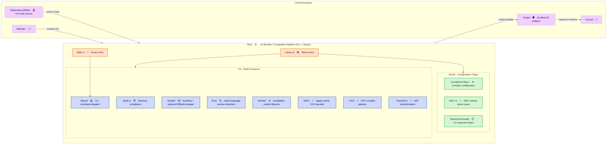

# **Rest**&#x2001;⛱️

<table>
	<tr>
		<td>
			<a href="https://GitHub.Com/CodeEditorLand/Rest" target="_blank">
				<picture>
					<source media="(prefers-color-scheme: dark)" srcset="https://img.shields.io/github/last-commit/CodeEditorLand/Rest?label=Update&color=black&labelColor=black&logoColor=white&logoWidth=0" />
					<source media="(prefers-color-scheme: light)" srcset="https://img.shields.io/github/last-commit/CodeEditorLand/Rest?label=Update&color=white&labelColor=white&logoColor=black&logoWidth=0" />
					
				</picture>
			</a>
			<br />
			<a href="https://GitHub.Com/CodeEditorLand/Rest" target="_blank">
				<picture>
					<source media="(prefers-color-scheme: dark)" srcset="https://img.shields.io/github/issues/CodeEditorLand/Rest?label=Issue&color=black&labelColor=black&logoColor=white&logoWidth=0" />
					<source media="(prefers-color-scheme: light)" srcset="https://img.shields.io/github/issues/CodeEditorLand/Rest?label=Issue&color=white&labelColor=white&logoColor=black&logoWidth=0" />
					
				</picture>
			</a>
		</td>
		<td>
			<a href="https://github.com/CodeEditorLand/Rest" target="_blank">
				<picture>
					<source media="(prefers-color-scheme: dark)" srcset="https://img.shields.io/github/stars/CodeEditorLand/Rest?style=flat&label=Star&logo=github&color=black&labelColor=black&logoColor=white&logoWidth=0" />
					<source media="(prefers-color-scheme: light)" srcset="https://img.shields.io/github/stars/CodeEditorLand/Rest?style=flat&label=Star&logo=github&color=white&labelColor=white&logoColor=black&logoWidth=0" />
					
				</picture>
			</a>
			<br />
			<a href="https://GitHub.Com/CodeEditorLand/Rest" target="_blank">
				<picture>
					<source media="(prefers-color-scheme: dark)" srcset="https://img.shields.io/github/downloads/CodeEditorLand/Rest/total?label=Download&color=black&labelColor=black&logoColor=white&logoWidth=0" />
					<source media="(prefers-color-scheme: light)" srcset="https://img.shields.io/github/downloads/CodeEditorLand/Rest/total?label=Download&color=white&labelColor=white&logoColor=black&logoWidth=0" />
					
				</picture>
			</a>
		</td>
	</tr>
</table>

The JS Bundler Configuration for Land&#x2001;🏞️

> **The Land editor needs to compile the `Dependency/Editor` VS Code source tree
> into self-contained `JavaScript` bundles that `Cocoon`&#x2001;🦋 can load at
> runtime. Without a dedicated compilation pipeline, every consumer would
> reinvent parsing, transformation, and codegen - leading to inconsistent
> output, duplicated work, and poor iteration times.**

_"One compilation pipeline, `OXC` at native speed, zero Node.js processes in the
hot path."_

[](https://github.com/CodeEditorLand/Rest/blob/Current/LICENSE)
[](https://www.rust-lang.org/) [](https://www.rust-lang.org/)
[](https://www.rust-lang.org/) Edition
2024

**[Rust API Documentation](https://rust.documentation.rest.editor.land/)**&#x2001;📖

---

## Overview

**Rest** is the JS bundler configuration for the **Land**&#x2001;🏞️ Code Editor.
It contains the build scripts and Rust compilation pipeline used to bundle the
VS Code platform code from the `Dependency/Editor` submodule (workbench,
services, platform layers) into self-contained `JavaScript` modules that
`Cocoon`&#x2001;🦋 can `require()` at runtime. Rest is invoked as a CLI
binary/build step - not a network service - during the Land build.

Rest's compilation backend is **OXC** (the Oxidation Compiler): a Rust-native
`TypeScript` 5.x parser, AST transformer, and code generator that runs at native
speed with no `Node.js` process in the hot path. The `SWC/` handler module is a
historical name retained for its call sites - internally it now runs on the same
OXC-backed compiler (see `Source/Fn/SWC/Compile.rs`), so both module names
converge on one implementation. An optional `ESBuild` wrapper
(`Source/Fn/Bundle/ESBuild.rs`) shells out to the `esbuild` CLI, if present on
the system, for bundling scenarios OXC alone doesn't cover (AMD output, complex
multi-file bundling).

The build/CLI surface is organized into modules under `Fn/` - one for builds,
one for bundling, one for the native language service, one for each compiler
pipeline, and so on. Every configuration and CLI-argument type lives in
`Struct/`, giving the entire pipeline compile-time type checking through Rust's
type system.

**Rest is engineered to:**

1. **Provide a Unified Compilation Pipeline** - Expose the `OXC`-backed
   compilation pipeline (still named `OXC` and `SWC` at the module level) as a
   `Rust` library and CLI with structured configuration and result types.
2. **Enable Fast TypeScript Transformation** - Leverage `OXC`'s parser,
   transformer, and codegen for `TypeScript` 5.x with decorator and JSX support
   at native speed.
3. **Support Build Workflows** - Handle directory compilation, optional
   `ESBuild` bundling, NLS (Native Language Service) extraction and replacement,
   and compilation worker management.
4. **Integrate with Land Architecture** - Serve as the build-time compilation
   step that produces the bundles `Output`&#x2001;⚫ ships and
   `Cocoon`&#x2001;🦋 loads, orchestrated by `Maintain`&#x2001;💪🏻.

---

## Key Features&#x2001;🔧

**OXC-Backed Compilation** - `OXC` (`Source/Fn/OXC/`) is the compiler that does
the parsing, transformation, and code generation. `SWC` (`Source/Fn/SWC/`) is a
module retained for naming/call-site compatibility - its `Compile.rs` runs the
same OXC-backed pipeline underneath rather than the `swc_core` crate.

**Type-Safe Configuration Layer** - Configuration and CLI-argument types defined
in `Struct/` provide compile-time validation of the entire pipeline surface.
Every entry point is schema-checked before it reaches production through
`Rust`'s type system.

**Modular Function Architecture** - Build logic is decomposed into `Fn/` modules
(`Build`, `Bundle`, `NLS`, `Worker`, `OXC`, `SWC`, `Transform`, `Binary`) each
responsible for a single compilation domain. Modules are composable, testable,
and independently maintainable.

**`ESBuild` Bundling** - Integration with `ESBuild` via
`Source/Fn/Bundle/ESBuild.rs` for fast production bundling with configurable
build profiles through `Source/Fn/Bundle/Config.rs`.

**Native Language Service** - NLS endpoints (`Source/Fn/NLS/`) provide
extraction, replacement, and bundling of native language strings for
internationalization workflows.

**Compilation Workers** - Dedicated worker lifecycle management
(`Source/Fn/Worker/`) with bootstrap, compilation, and capability detection for
parallel compilation across multiple cores.

**Watch Mode** - Both the `OXC` and `SWC` module namespaces support file-system
watch mode via `Source/Fn/OXC/Watch.rs` and `Source/Fn/SWC/Watch/` for
incremental recompilation on file changes.

---

## Core Architecture Principles&#x2001;🏗️

| Principle               | Description                                                                                                                                                     | Key Components                                                                                  |
| ----------------------- | --------------------------------------------------------------------------------------------------------------------------------------------------------------- | ----------------------------------------------------------------------------------------------- |
| **Function Modularity** | Build logic is decomposed into focused `Fn/` modules, each responsible for a single compilation domain. Modules are composable and independently testable.      | `Fn/Build`, `Fn/Bundle`, `Fn/NLS`, `Fn/Worker`, `Fn/OXC`, `Fn/SWC`, `Fn/Transform`, `Fn/Binary` |
| **Type Safety**         | Configuration and CLI-argument schemas live in `Struct/` for compile-time validation. Every entry point is schema-checked through `Rust`'s type system.         | `Struct/CompilerConfig`, `Struct/SWC`, `Struct/Binary`                                          |
| **OXC-Backed Pipeline** | A single `OXC`-based compiler backs both the `OXC` and `SWC` module namespaces; `SWC` is retained for call-site compatibility, not a second compilation engine. | `Fn/OXC/Compiler`, `Fn/SWC/Compile`                                                             |
| **Performance First**   | Native `Rust` compilation with zero-cost abstractions and parallel compilation via `rayon` for multi-core throughput - no `Node.js` process in the hot path.    | `Source/Library.rs`, `Source/Main.rs`, `Fn/Binary/Command/Parallel`                             |

---

## System Architecture



**Connection paths:**

| Path                      | Protocol              | Use Case                                           |
| ------------------------- | --------------------- | -------------------------------------------------- |
| Maintain&#x2001;💪🏻 → Rest | CLI invocation        | Triggers compilation as part of the Land build     |
| Dependency/Editor → Rest  | File-system read      | Source input - VS Code TypeScript/JavaScript tree  |
| Rest → Output&#x2001;⚫   | File-system write     | Writes bundled `JavaScript` artifacts              |
| Output → Cocoon&#x2001;🦋 | `Node.js` `require()` | Cocoon loads the bundles Rest produced at runtime  |
| Rest → OXC Compiler       | Direct call           | `TypeScript` 5.x parsing, transformation, codegen  |
| Rest → ESBuild            | Subprocess (optional) | Fallback bundling for AMD output / complex bundles |

---

## Key Components

| Component              | Path                                  | Description                                              |
| ---------------------- | ------------------------------------- | -------------------------------------------------------- |
| Library (Entry)        | `Source/Library.rs`                   | Library root - `rlib`, `cdylib`, and `staticlib` targets |
| Binary Entry           | `Source/Main.rs`                      | CLI binary entry point                                   |
| OXC Compiler           | `Source/Fn/OXC/Compiler.rs`           | Main OXC-based compiler orchestration                    |
| OXC Parser             | `Source/Fn/OXC/Parser.rs`             | OXC parser wrapper for `TypeScript` 5.x                  |
| OXC Transformer        | `Source/Fn/OXC/Transformer.rs`        | AST transformation (decorators, class fields, JSX)       |
| OXC Codegen            | `Source/Fn/OXC/Codegen.rs`            | Code generation from transformed AST                     |
| OXC Compile            | `Source/Fn/OXC/Compile.rs`            | Full OXC compilation pipeline                            |
| OXC Watch              | `Source/Fn/OXC/Watch.rs`              | Watch mode for OXC compilation                           |
| SWC Compiler           | `Source/Fn/SWC/Compile.rs`            | SWC-based compilation pipeline                           |
| SWC Watch              | `Source/Fn/SWC/Watch.rs`              | Watch mode for SWC compilation                           |
| Build Mode             | `Source/Fn/Build.rs`                  | Directory compilation handler                            |
| Bundle Builder         | `Source/Fn/Bundle/Builder.rs`         | Bundle builder orchestration                             |
| Bundle Config          | `Source/Fn/Bundle/Config.rs`          | Bundle configuration profiles                            |
| ESBuild                | `Source/Fn/Bundle/ESBuild.rs`         | `ESBuild` integration for fast bundling                  |
| NLS Extract            | `Source/Fn/NLS/Extract.rs`            | NLS string extraction                                    |
| NLS Replace            | `Source/Fn/NLS/Replace.rs`            | NLS string replacement                                   |
| NLS Bundle             | `Source/Fn/NLS/Bundle.rs`             | NLS bundling                                             |
| Worker Bootstrap       | `Source/Fn/Worker/Bootstrap.rs`       | Worker initialization                                    |
| Worker Compile         | `Source/Fn/Worker/Compile.rs`         | Worker compilation                                       |
| Worker Detect          | `Source/Fn/Worker/Detect.rs`          | Worker capability detection                              |
| Transform PrivateField | `Source/Fn/Transform/PrivateField.rs` | Private field AST transforms                             |
| Binary Commands        | `Source/Fn/Binary/Command/`           | CLI command handlers (Sequential, Parallel, Entry)       |
| Compiler Config        | `Source/Struct/CompilerConfig.rs`     | Compiler configuration types                             |
| SWC Types              | `Source/Struct/SWC.rs`                | SWC-related type definitions                             |
| Binary Command Types   | `Source/Struct/Binary/Command/`       | CLI argument and option types                            |

---

## Project Structure&#x2001;🗺️

```
Element/Rest/
├── Source/
│   ├── Library.rs              # Library root (rlib + cdylib + staticlib)
│   ├── Main.rs                 # Binary entry point (CLI)
│   ├── Binary.rs               # Binary initialization
│   ├── Fn/                     # API handler modules
│   │   ├── mod.rs              # Module re-exports
│   │   ├── Build.rs            # Directory compilation endpoint
│   │   ├── Bundle/             # Bundling API
│   │   │   ├── mod.rs
│   │   │   ├── Builder.rs      # Bundle builder
│   │   │   ├── Config.rs       # Bundle configuration
│   │   │   └── ESBuild.rs      # ESBuild integration
│   │   ├── NLS/                # Native Language Service endpoints
│   │   │   ├── mod.rs
│   │   │   ├── Bundle.rs       # NLS bundling
│   │   │   ├── Extract.rs      # NLS extraction
│   │   │   └── Replace.rs      # NLS replacement
│   │   ├── Worker/             # Compilation worker API
│   │   │   ├── mod.rs
│   │   │   ├── Bootstrap.rs    # Worker initialization
│   │   │   ├── Compile.rs      # Worker compilation
│   │   │   └── Detect.rs       # Worker capability detection
│   │   ├── OXC/                # OXC compiler endpoints
│   │   │   ├── mod.rs
│   │   │   ├── Codegen.rs      # Code generation
│   │   │   ├── Compile.rs      # Compilation pipeline
│   │   │   ├── Compiler.rs     # Compiler orchestration
│   │   │   ├── Parser.rs       # OXC parser wrapper
│   │   │   ├── Transformer.rs  # AST transformation
│   │   │   └── Watch.rs        # Watch mode
│   │   ├── SWC/                # SWC compiler endpoints
│   │   │   ├── mod.rs
│   │   │   ├── Compile.rs      # SWC compilation
│   │   │   └── Watch/          # SWC watch mode
│   │   │       └── Compile.rs
│   │   ├── Transform/          # AST transformation endpoints
│   │   │   ├── mod.rs
│   │   │   └── PrivateField.rs # Private field transforms
│   │   └── Binary/             # Binary command handlers
│   │       ├── mod.rs
│   │       ├── Command.rs      # Command dispatcher
│   │       └── Command/        # Command implementations
│   │           ├── Entry.rs    # Entry command
│   │           ├── Parallel.rs # Parallel execution
│   │           └── Sequential.rs # Sequential execution
│   └── Struct/                 # Data type definitions
│       ├── mod.rs
│       ├── CompilerConfig.rs   # Compiler configuration schema
│       ├── SWC.rs              # SWC type definitions
│       └── Binary/             # Binary command types
│           ├── mod.rs
│           ├── Command.rs      # Command argument types
│           └── Command/        # Command option types
│               ├── Entry.rs
│               └── Option.rs
└── Documentation/
    └── Rust/
        └── doc/                # Cargo doc output
```

---

## In the Land Project

Rest serves as the build-time JS bundler for the Land ecosystem, compiling the
`Dependency/Editor` VS Code source tree into the `JavaScript` bundles that
`Cocoon` loads at runtime. It runs as a CLI/library invoked during the Land
build (orchestrated by `Maintain`), executes through `Fn/` build modules backed
by the `OXC` compiler pipeline, and configures itself through `Struct/`
type-safe data definitions.

Rest is the compilation step for the broader Land toolchain:

| Consumer                        | Role              | Integration                                                         |
| ------------------------------- | ----------------- | ------------------------------------------------------------------- |
| **Maintain**&#x2001;💪🏻          | Build system      | Invokes the Rest CLI/binary as part of the Land build orchestration |
| **Dependency/Editor**&#x2001;💻 | VS Code source    | Input tree Rest reads and compiles                                  |
| **Output**&#x2001;⚫            | Bundled JS output | Destination directory for the bundles Rest produces                 |
| **Cocoon**&#x2001;🦋            | Extension host    | Loads (`require()`s) the bundles Rest produced, via `Output`        |

Rest depends on `Common`&#x2001;🧑🏻‍🏭 for shared type definitions and
utility functions used across the Land Rust infrastructure.

---

## Getting Started&#x2001;🚀

### Prerequisites

- **Rust** 1.95.0 or later (edition 2024)

### Build

```bash
cd Element/Rest
cargo build --release
```

### Key Dependencies

| Dependency        | Purpose                                            |
| ----------------- | -------------------------------------------------- |
| `oxc_parser`      | `TypeScript`/`JavaScript` parsing                  |
| `oxc_transformer` | AST transformation (decorators, JSX, class fields) |
| `oxc_codegen`     | Code generation from transformed AST               |
| `oxc_minifier`    | Code minification                                  |
| `oxc_semantic`    | Semantic analysis and type checking                |
| `oxc_ast`         | AST type definitions                               |
| `rayon`           | Parallel compilation across CPU cores              |
| `tokio`           | Async runtime for the CLI/build pipeline           |
| `clap`            | CLI argument parsing                               |
| `notify`          | File-system watch notifications                    |
| `walkdir`         | Recursive directory traversal for source discovery |
| `globset`         | Glob-pattern matching for include/exclude filters  |
| `Common`          | Shared Land type definitions and utilities         |

### As a Library

```toml
[dependencies]
Rest = { git = "https://github.com/CodeEditorLand/Rest.git", branch = "Current" }
```

---

## Security&#x2001;🔒

Rest enforces security at multiple layers:

| Layer                   | Mechanism                                                                                                                                                                     |
| ----------------------- | ----------------------------------------------------------------------------------------------------------------------------------------------------------------------------- |
| **Type safety**         | `Rust`'s compile-time type system validates all configuration and CLI-argument schemas through `Struct/` data types - malformed input is rejected before reaching build logic |
| **Memory safety**       | `Rust`'s ownership model eliminates buffer overflows, use-after-free, and data races without a garbage collector                                                              |
| **Input validation**    | Structured deserialization via `serde` and `clap` ensures all configuration inputs and CLI arguments are validated at the boundary                                            |
| **Compiler sandboxing** | The `OXC`-backed compiler pipeline operates on in-memory ASTs - no file-system access beyond the explicitly configured input/output directories                               |

---

## Compatibility

Rest is designed to be compatible with:

| Target                          | Integration                                                      |
| ------------------------------- | ---------------------------------------------------------------- |
| **Maintain**&#x2001;💪🏻          | Invoked as a CLI/build step for compilation and build operations |
| **Dependency/Editor**&#x2001;💻 | Reads VS Code `TypeScript`/`JavaScript` source as build input    |
| **Output**&#x2001;⚫            | Writes bundled `JavaScript` artifacts consumed at runtime        |
| **Cocoon**&#x2001;🦋            | Indirect - loads the bundles Rest produced, via `Output`         |
| **Common**&#x2001;🧑🏻‍🏭            | Shared trait implementations and type definitions                |

---

## API Reference

- **[Rust API Documentation](https://rust.documentation.rest.editor.land/)**&#x2001;📖

---

## Related Documentation

- [Architecture Overview](https://Editor.Land/Doc/architecture) - Land system
  architecture
- [Why Rust](https://Editor.Land/Doc/why-rust) - Why `Rust` for Land
  infrastructure
- [Maintain](https://github.com/CodeEditorLand/Maintain)&#x2001;💪🏻 - Build
  system and development runner
- [Cocoon](https://github.com/CodeEditorLand/Cocoon)&#x2001;🦋 -
  `Node.js`/`Effect-TS` extension host
- [Output](https://github.com/CodeEditorLand/Output)&#x2001;⚫ - Bundled JS
  output consumed by `Cocoon`
- [Common](https://github.com/CodeEditorLand/Common)&#x2001;🧑🏻‍🏭 - Shared abstract
  foundation
- [Land Documentation Index](https://Editor.Land/Doc) - Full documentation index

---

## License&#x2001;⚖️

This project is released into the public domain under the **Creative Commons CC0
Universal** license. You are free to use, modify, distribute, and build upon
this work for any purpose, without any restrictions. For the full legal text,
see the [`LICENSE`](https://github.com/CodeEditorLand/Rest/tree/Current/LICENSE)
file.

---

## Changelog&#x2001;📜

Stay updated with our progress! See
[`CHANGELOG.md`](https://github.com/CodeEditorLand/Rest/tree/Current/CHANGELOG.md)
for a history of changes.

---

## Funding & Acknowledgements&#x2001;🙏🏻

**Land**&#x2001;🏞️ is proud to be an open-source endeavor. Our journey is
significantly supported by the organizations and projects that believe in the
future of open-source software.

This project is funded through
[NGI0 Commons Fund](https://NLnet.NL/commonsfund), a fund established by
[NLnet](https://NLnet.NL) with financial support from the European Commission's
[Next Generation Internet](https://ngi.eu) program. Learn more at the
[NLnet project page](https://NLnet.NL/project/Land).

<table>
	<thead>
		<tr>
			<th align="left">
				<strong>
					Land
				</strong>
			</th>
			<th align="left">
				<strong>
					PlayForm
				</strong>
			</th>
			<th align="left">
				<strong>
					NLnet
				</strong>
			</th>
			<th align="left">
				<strong>
					NGI0 Commons Fund
				</strong>
			</th>
		</tr>
	</thead>
	<tbody>
		<tr>
			<td align="left" valign="middle">
				<a href="https://editor.land">
					
				</a>
			</td>
			<td align="left" valign="middle">
				<a href="https://PlayForm.Cloud">
					
				</a>
			</td>
			<td align="left" valign="middle">
				<a href="https://NLnet.NL">
					
				</a>
			</td>
			<td align="left" valign="middle">
				<a href="https://NLnet.NL/commonsfund">
					
				</a>
			</td>
		</tr>
	</tbody>
</table>

---

**Project Maintainers**: Source Open
([Source/Open@editor.land](mailto:Source/Open@editor.land)) |
[GitHub Repository](https://github.com/CodeEditorLand/Rest) |
[Report an Issue](https://github.com/CodeEditorLand/Rest/issues) |
[Security Policy](https://github.com/CodeEditorLand/Rest/security/policy)
